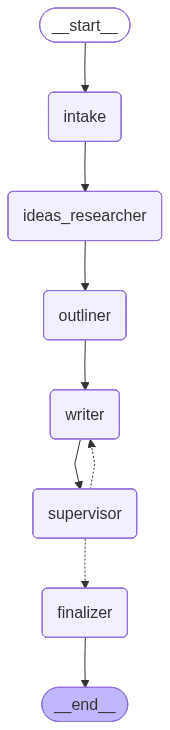
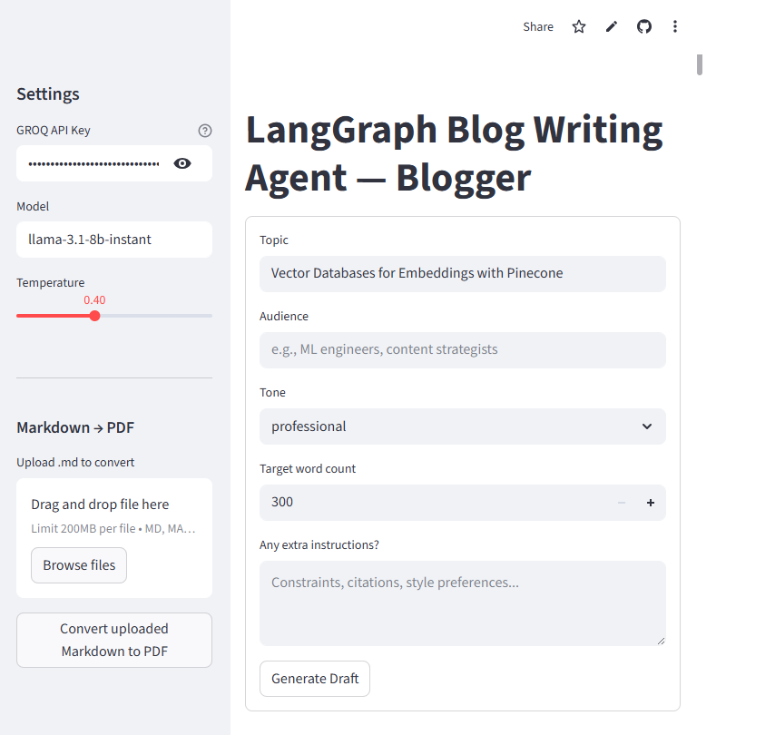
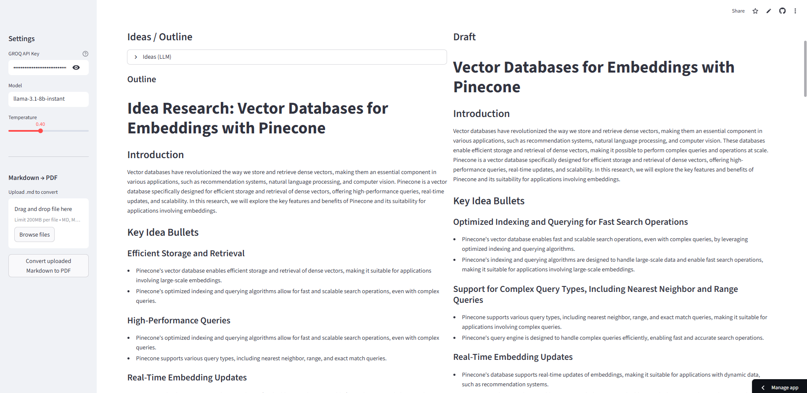

# Blogger —— LangGraph Writing Agent

This project implements a multi-node LangGraph agent for automated blog generation. "Blogger" is an AI-powered pipeline that researches ideas, builds outlines, and drafts blog posts tailored to your audience and tone. It loops through supervisor feedback until approval, then finalizes polished content with SEO-ready metadata.
It guides a topic through stages: 


## Interface —— 🖇️try here[Blogger](https://bloggraph.streamlit.app/)  : 

### Draft and Supervisor Notes  


### Final Output  


## Features

- Interactive Streamlit interface for entering topic, audience, tone, and instructions.  
- Full pipeline:  
  1. Idea research and keyword suggestions  
  2. Outline generation  
  3. Draft writing  
  4. Supervisor feedback with revision loop  
  5. Final content packaging (title, meta description, slug, tags, body markdown)  
- Export tools:  
  - Download final Markdown  
  - Convert Markdown to styled PDF  
  - Sidebar tool for uploading and converting any `.md` file to PDF  

## Requirements

- Python 3.10 or higher  
- A valid [Groq API key](https://console.groq.com/)  

## Installation

Clone the repository and install dependencies:

```bash
git clone https://github.com/vinabi/blogger.git
cd blogger
pip install -r requirements.txt

